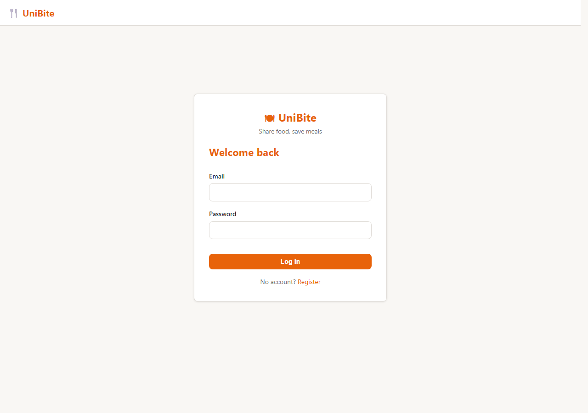
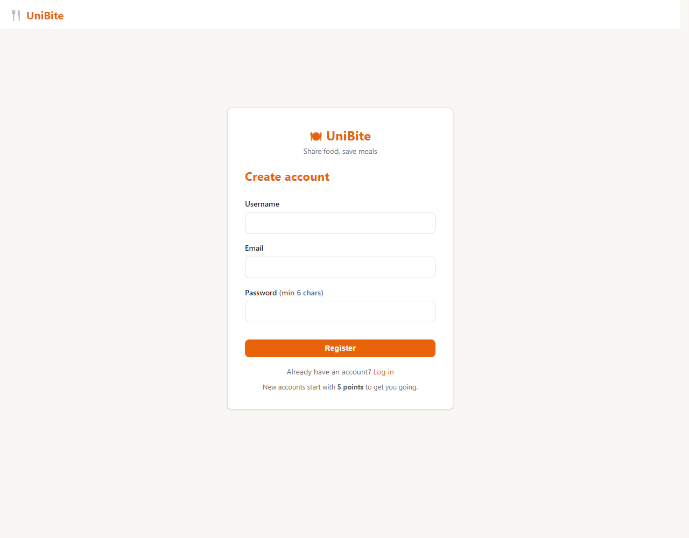
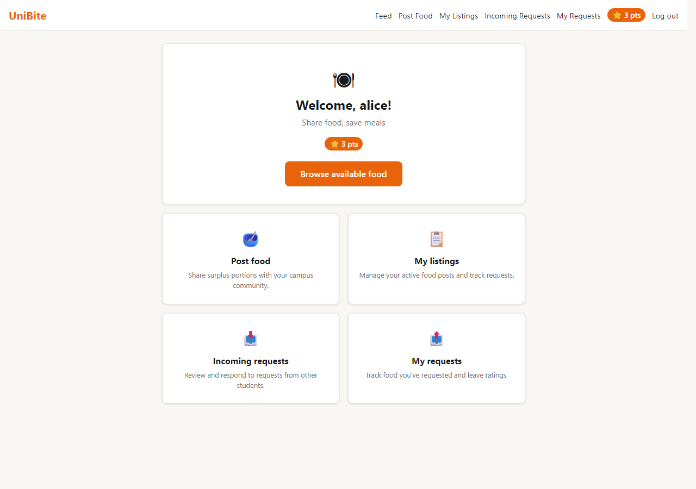
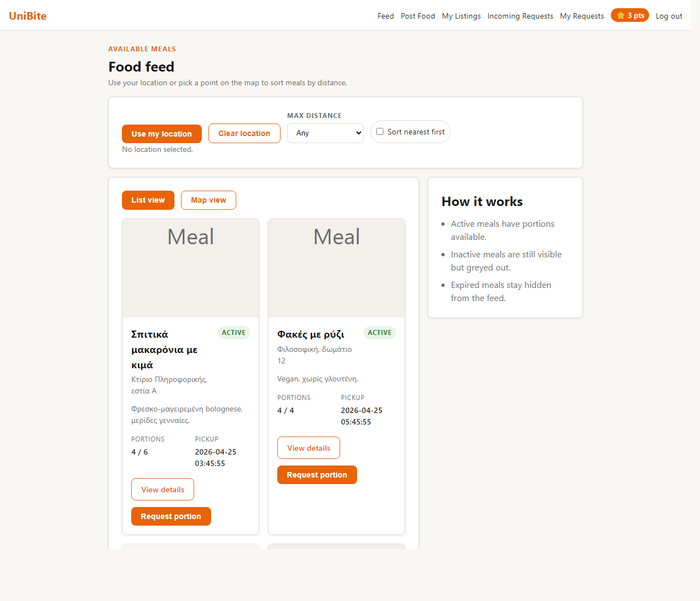
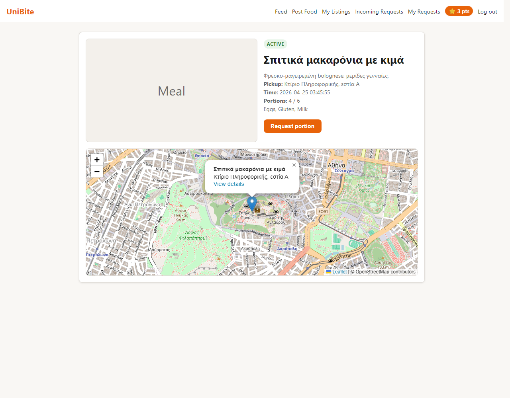
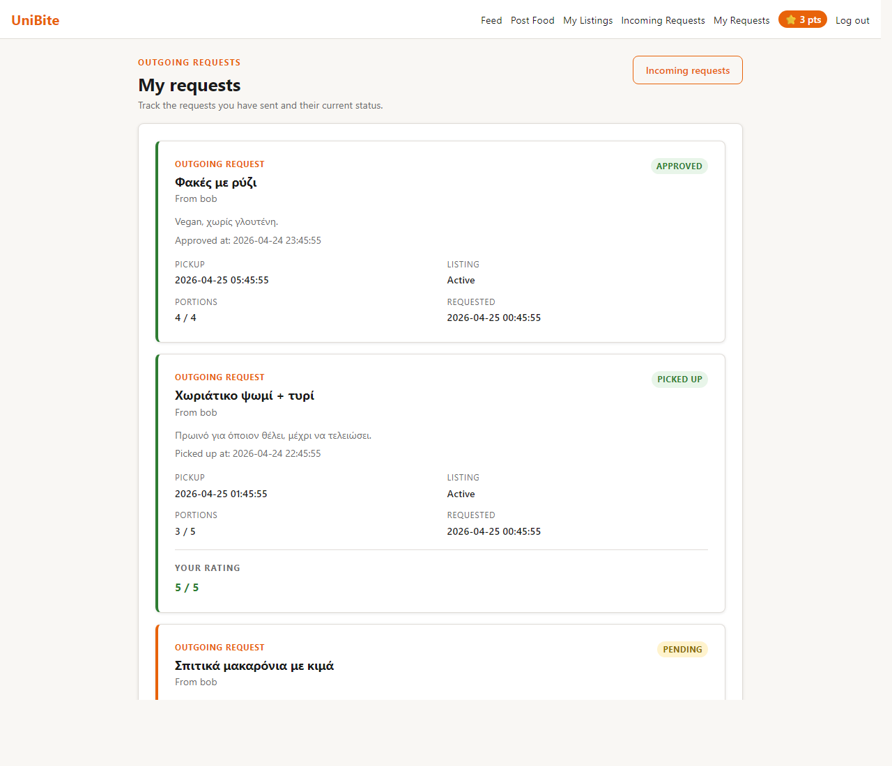
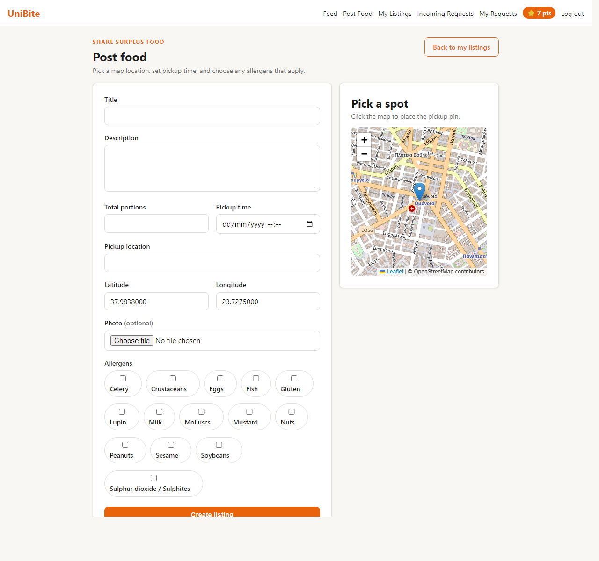
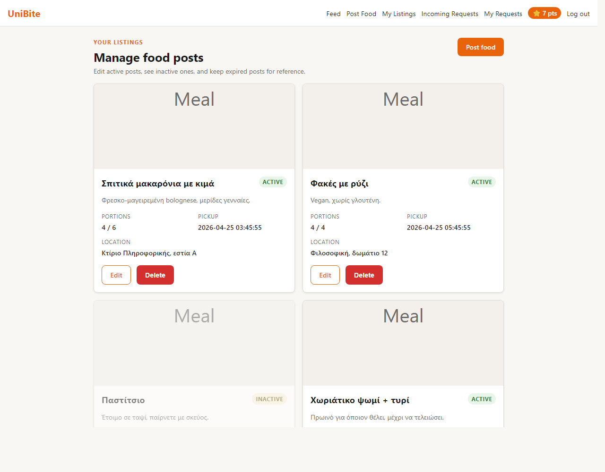
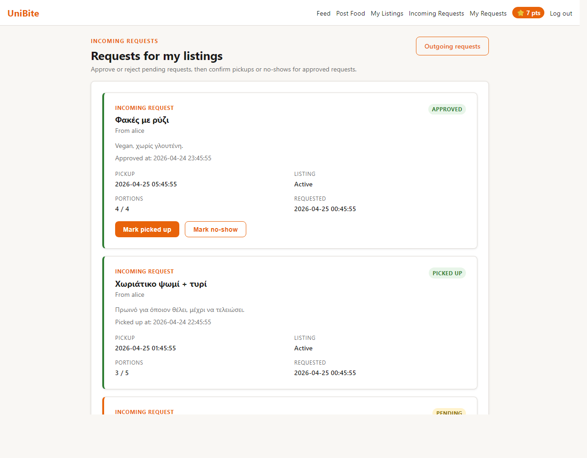
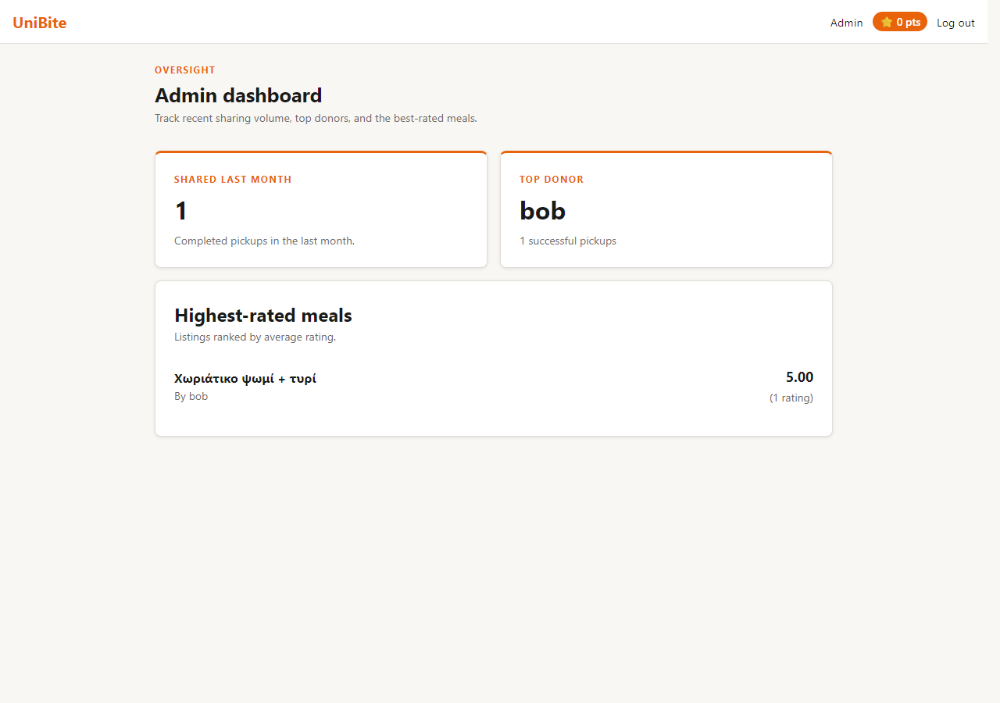

# UniBite — Documentation

A student food-sharing web app. Students who cook extra portions post a listing;
classmates request one with credits ("points"). Built with classic PHP multi-page
rendering and small JSON endpoints driven by `fetch()` + DOM manipulation.

Spec: [docs/assignment.pdf](assignment.pdf).

---

## 1. Stack & layout

| Layer        | Choice                                                       |
|--------------|--------------------------------------------------------------|
| Server       | PHP (built-in dev server or XAMPP Apache)                    |
| DB           | MySQL via PDO (singleton in [includes/db.php](../includes/db.php)) |
| Auth         | PHP session cookie (`$_SESSION['user']`)                     |
| Front-end    | Vanilla JS + Leaflet for the map. No frameworks, no bundler. |
| Transport    | All API calls are `POST` with `URLSearchParams`, JSON reply  |

Directory layout:

```
api/         JSON endpoints (auth, listings, requests, ratings, stats)
includes/    db, helpers, auth guards (server-only)
db/          schema.sql + seed.sql
js/          api.js (fetch wrapper) + per-page modules
css/         single stylesheet
uploads/     user-uploaded photos
*.php        page templates (one file per route)
```

---

## 2. Data model (7 tables)

ER summary — full DDL in [db/schema.sql](../db/schema.sql).

```
users (id, username, email, password_hash, role, points, created_at)
  └─< listings (provider_id, title, description, photo_path,
                portions_total, portions_available,
                pickup_location, pickup_lat, pickup_lng, pickup_time,
                created_at, deleted_by_owner_at)
        ├─< listing_allergens >── allergens (EU-14, seeded once)
        └─< requests (consumer_id, status, approved_at, picked_up_at, no_show_at)
              ├── ratings (request_id UNIQUE, score 1-5)
              └── point_events (user_id, request_id, delta, reason)
```

`point_events` is both an audit log and an idempotency guard: the
`UNIQUE(user_id, request_id, reason)` key prevents the same lifecycle event
from being applied twice (e.g. clicking "Mark picked up" again on a
double-render). Initial signup credits use `request_id IS NULL` and are
guarded by an `INSERT … WHERE NOT EXISTS` in
[api/auth.php:86-93](../api/auth.php).

A listing's effective state is derived in SQL, not stored:

```sql
CASE
  WHEN created_at <= NOW() - INTERVAL 48 HOUR THEN 'expired'
  WHEN portions_available = 0                  THEN 'inactive'
  ELSE 'active'
END
```

Expired listings stay in the DB for stats (Δ1) but are filtered out of feed
and request queries.

---

## 3. Roles & lifecycle

Three roles per the spec: **provider** and **consumer** are both `student`
(any student can do both); **admin** sees the dashboard.

Request status machine:

```
            send                  approve            pickup
  (none) ─────────►  pending  ─────────► approved ─────────► picked_up
                       │                    │
                       │ reject             │ noshow
                       ▼                    ▼
                    rejected             no_show
```

After `picked_up`, the consumer has a 48 h window to leave a rating; missing
the window triggers a lazy `rating_timeout` penalty applied on next login
([includes/helpers.php:43](../includes/helpers.php)).

---

## 4. Points rules

Mapping spec → code:

| Event                                  | Δ points          | Code                                                  |
|----------------------------------------|-------------------|-------------------------------------------------------|
| New account (Γ2)                       | consumer +5       | [api/auth.php:86](../api/auth.php) `'initial'`        |
| Request approved (B3)                  | consumer −1       | [api/requests.php:328](../api/requests.php) `'request_approved'` |
| Pickup confirmed (B4 base)             | provider +1       | [api/requests.php:510](../api/requests.php) `'pickup_base'` |
| Rating > 3 / 5 (B4 bonus)              | provider +1       | [api/ratings.php](../api/ratings.php) `'pickup_bonus'`|
| No-show (B3)                           | consumer −1       | [api/requests.php:619](../api/requests.php) `'no_show'`|
| No rating in 48 h (Γ3)                 | consumer −1       | [includes/helpers.php:63](../includes/helpers.php) `'rating_timeout'`|

**Floor at 0.** The send/approve guard already enforces `points >= 1`. The
two penalty paths (`no_show`, `rating_timeout`) additionally clamp at 0:
they still record the status change and write a `point_events` row (with
`delta = 0` so the rating-timeout sweep doesn't re-fire forever), but skip
the `UPDATE users` when the user is already at zero.

---

## 5. Walkthrough with screenshots

### 5.1 Login & registration

Public landing page. Form posts to `api/auth.php` via `fetch()`, then JS
redirects on success — no full page reload.




### 5.2 Student home

Lands here after login. Shows the points pill in the header (cached in the
session, refreshed after each scoring event).



### 5.3 Feed (Γ1 — list + map + distance)

All active listings as cards plus a Leaflet map with markers. The
**ACTIVE** / **INACTIVE** badge in the corner reflects the SQL-derived
status above; inactive cards (0 portions) are greyed out. The "Use my
location" / "Sort nearest first" controls compute Haversine distance in
[js/feed.js](../js/feed.js) — the server returns lat/lng with each listing.



### 5.4 Listing detail

Map zoomed to the pickup point, allergens listed, "Request portion" button.
The request guard re-checks portions and consumer points server-side
([api/requests.php:108-121](../api/requests.php)) — the button is just a
hint.



### 5.5 Outgoing requests (consumer)

The consumer's request board. Each card shows the lifecycle state with a
coloured rail: **PENDING** (orange), **APPROVED** (green), **PICKED UP**
(green + rating widget). After pickup a 1-5 star input appears; once
submitted it freezes to `5 / 5`.



### 5.6 Create listing (B1, B2)

Provider form: title, description, optional photo, EU-14 allergen
checkboxes (loaded from the `allergens` table), and a Leaflet picker that
captures `pickup_lat`/`pickup_lng`. Pickup time is required.



### 5.7 My listings

Provider's own listings with portions remaining and edit / delete actions.
The 48 h auto-expiry is enforced by the SQL filter, not by a cron job.



### 5.8 Incoming requests (B3)

Provider's control panel. Pending requests show **Approve / Reject**;
approved ones show **Mark picked up / Mark no-show**. Each action is one
`fetch()` call to `api/requests.php`; the card re-renders in place.



### 5.9 Admin dashboard (Δ1, Δ2)

Three stats served by [api/stats.php](../api/stats.php):
- Successful pickups in the last 30 days
- Top donor (most pickups recorded against their listings)
- Highest-rated meals (avg score, with sample size)



---

## 6. Front-end notes (Ε1 / Ε2 / Ε3)

- **DOM & events:** all forms `e.preventDefault()` and update the DOM in
  place — see e.g. [js/requests.js](../js/requests.js) which removes a
  request card from the list after a successful approve/reject without
  reloading.
- **fetch + JSON:** single helper `apiPost()` in
  [js/api.js](../js/api.js) returns the parsed `{ ok, data, error }`
  envelope used everywhere.
- **Responsive:** Flexbox + Grid in [css/style.css](../css/style.css);
  the nav collapses to a hamburger via media queries, cards reflow at
  narrow widths.

---

## 7. Running locally

```
# 1. MySQL (XAMPP)
C:\Users\bgthe\Pictures\xamp\mysql_start.bat

# 2. First-time DB setup
mysql -u root -e "CREATE DATABASE unibite"
mysql -u root unibite < db/schema.sql
mysql -u root unibite < db/seed.sql

# 3. PHP dev server
php -S localhost:8000

# 4. Visit http://localhost:8000  (alice@student.local / test123)
```

Seed users:

| Email                 | Password  | Role    |
|-----------------------|-----------|---------|
| admin@unibite.local   | admin123  | admin   |
| alice@student.local   | test123   | student |
| bob@student.local     | test123   | student |
